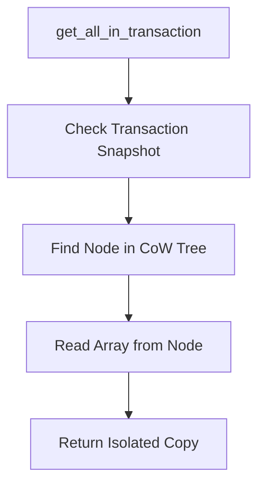
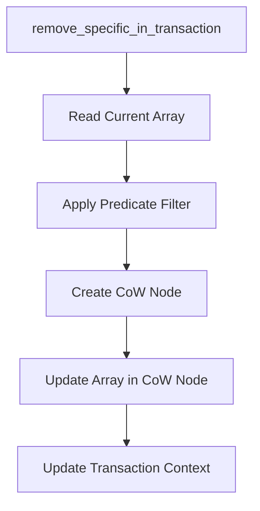

# Creative Phase: Architecture Design - Transaction Integration

## Problem Definition
Необходимо интегрировать новые транзакционные методы (`get_all_in_transaction`, улучшенный `remove_in_transaction`) в существующую архитектуру B+ Tree без нарушения ACID-свойств и обратной совместимости.

## Current State Analysis
- TransactionContext.ts реализует Copy-on-Write механизм
- Существует базовая поддержка транзакций для основных операций
- Отсутствуют методы для безопасного чтения неуникальных ключей в транзакциях
- `remove_in_transaction` не поддерживает селективное удаление из массивов

## Architectural Challenges

### Challenge 1: Snapshot Isolation for Non-Unique Keys
**Problem**: Как обеспечить изолированное чтение массивов значений для неуникальных ключей?
**Current Gap**: `get_all_in_transaction` отсутствует

### Challenge 2: Atomic Array Modifications
**Problem**: Как атомарно модифицировать массивы значений в рамках транзакции?
**Current Gap**: `remove_in_transaction` работает только с единичными значениями

### Challenge 3: CoW Integration
**Problem**: Как интегрировать новые методы с существующим Copy-on-Write механизмом?
**Current Gap**: Новые методы должны следовать существующим паттернам CoW

## Options Analysis

### Option 1: Extend Existing Transaction Methods
**Approach**: Расширить существующие методы дополнительными параметрами
- **Pros**: Минимальные изменения API, обратная совместимость
- **Cons**: Усложнение сигнатур методов, потенциальная путаница
- **Verdict**: 🤔 Частично приемлемо

### Option 2: Add New Specialized Methods
**Approach**: Создать новые методы специально для работы с массивами
- **Pros**: Четкое разделение ответственности, понятный API
- **Cons**: Увеличение размера API, дублирование логики
- **Verdict**: ✅ Предпочтительный подход

### Option 3: Generic Transaction Framework
**Approach**: Создать универсальный фреймворк для всех транзакционных операций
- **Pros**: Максимальная гибкость, единообразие
- **Cons**: Overengineering, сложность реализации
- **Verdict**: ❌ Слишком сложно для текущих требований

## Selected Approach: Add New Specialized Methods

### Architecture Design

#### 1. Transaction Context Extension
```typescript
interface ITransactionContext {
  // Existing methods...

  // New methods for array operations
  get_all_in_transaction<T, K>(tree: BPlusTree<T, K>, key: K): T[]
  remove_from_array_in_transaction<T, K>(
    tree: BPlusTree<T, K>,
    key: K,
    predicate: (item: T) => boolean
  ): boolean
}
```

#### 2. BPlusTree Integration
```typescript
class BPlusTree<T, K> {
  // Existing methods...

  // New transactional methods
  get_all_in_transaction(key: K, txContext: ITransactionContext): T[]
  remove_specific_in_transaction(
    key: K,
    predicate: (item: T) => boolean,
    txContext: ITransactionContext
  ): boolean
}
```

#### 3. Node-Level Support
```typescript
class Node<T, K> {
  // Enhanced methods for array operations
  get_all_cow(key: K, txContext: ITransactionContext): T[]
  remove_specific_cow(
    key: K,
    predicate: (item: T) => boolean,
    txContext: ITransactionContext
  ): boolean
}
```

### Implementation Strategy

#### Phase 1: TransactionContext Enhancement
1. **Extend ITransactionContext interface**
   - Добавить новые методы для работы с массивами
   - Сохранить обратную совместимость

2. **Implement Snapshot Reading**
   - `get_all_in_transaction`: чтение массива из снимка транзакции
   - Изоляция от внешних изменений
   - Корректная работа с CoW узлами

#### Phase 2: Array Modification Logic
1. **Selective Removal Implementation**
   - `remove_specific_in_transaction`: удаление по предикату
   - Атомарная модификация массивов
   - Создание новых CoW узлов при необходимости

2. **CoW Integration**
   - Использование существующих паттернов CoW
   - Корректное управление версиями узлов
   - Откат изменений при abort

#### Phase 3: Node-Level Operations
1. **Enhanced Node Methods**
   - `get_all_cow`: чтение массива с учетом CoW
   - `remove_specific_cow`: модификация массива с CoW
   - Оптимизация производительности

### Data Flow Design

#### 1. Transactional Read Flow


#### 2. Transactional Modify Flow


### Memory Management

#### 1. CoW Node Creation
- Создание новых узлов только при необходимости
- Переиспользование неизмененных узлов
- Эффективное управление памятью

#### 2. Array Copying Strategy
- Shallow copy для неизмененных элементов
- Deep copy только для модифицированных массивов
- Оптимизация для больших массивов

### Error Handling

#### 1. Transaction Consistency
```typescript
try {
  // Transactional operations
  const items = tree.get_all_in_transaction(key, txContext)
  const filtered = items.filter(predicate)
  tree.remove_specific_in_transaction(key, predicate, txContext)
} catch (error) {
  txContext.abort() // Automatic rollback
  throw error
}
```

#### 2. Validation
- Проверка валидности транзакционного контекста
- Валидация предикатов
- Обработка edge cases (пустые массивы, несуществующие ключи)

### Performance Considerations

#### 1. Read Performance
- O(log n) для поиска узла
- O(k) для копирования массива размера k
- Минимальные накладные расходы на изоляцию

#### 2. Write Performance
- O(log n + k) для модификации массива
- CoW создание только при необходимости
- Batch операции для множественных изменений

### Testing Strategy

#### 1. Isolation Tests
- Проверка изоляции между транзакциями
- Тесты на phantom reads и dirty reads
- Concurrent access scenarios

#### 2. Consistency Tests
- ACID compliance verification
- Rollback correctness
- Data integrity after abort/commit

#### 3. Performance Tests
- Benchmarks для новых методов
- Memory usage profiling
- Comparison с non-transactional operations

## Decision Summary

**Selected Architecture**: Specialized Methods with CoW Integration
**Rationale**:
- Четкое разделение ответственности
- Сохранение обратной совместимости
- Интеграция с существующими паттернами CoW
- Оптимальная производительность

**Key Design Principles**:
1. **Isolation**: Полная изоляция транзакций
2. **Consistency**: ACID compliance
3. **Performance**: Минимальные накладные расходы
4. **Compatibility**: Обратная совместимость API

**Implementation Priority**: High
**Estimated Effort**: 3-4 дня
**Risk Level**: Medium-High (требует глубокого понимания CoW механизма)

## Next Steps
1. Изучить существующий TransactionContext код
2. Реализовать базовые транзакционные методы
3. Интегрировать с Node-level операциями
4. Создать comprehensive тесты для изоляции
5. Оптимизировать производительность