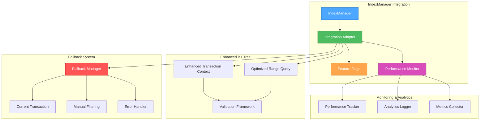

# 🎨🎨🎨 ENTERING CREATIVE PHASE: INTEGRATION ARCHITECTURE DESIGN 🎨🎨🎨

**Date**: 2024-12-19
**Phase**: Creative Phase 3 of 3
**Objective**: Design seamless integration architecture between enhanced b-pl-tree and IndexManager
**Complexity**: High - System integration with multiple fallback strategies and monitoring

## PROBLEM STATEMENT

### Core Issue
Необходимо интегрировать улучшенные transaction commit механизмы и range query алгоритмы в существующий IndexManager, обеспечив seamless integration, graceful degradation и comprehensive monitoring.

### Technical Context
- **Target System**: IndexManager (Collection Store v6)
- **Enhanced Components**: Transaction commit logic, Range query algorithms
- **Integration Points**: Transaction handling, Range queries, Error propagation
- **Existing Workarounds**: Manual filtering, simplified transaction approach
- **Requirements**: Backward compatibility, performance monitoring, fallback mechanisms

### Requirements & Constraints

#### Integration Requirements:
1. **Seamless Integration**: Минимальные изменения в existing IndexManager API
2. **Graceful Degradation**: Automatic fallback к working approaches при failures
3. **Performance Monitoring**: Comprehensive tracking и analytics
4. **Error Propagation**: Intelligent error handling и reporting
5. **Backward Compatibility**: Поддержка existing functionality

#### Technical Constraints:
1. **API Stability**: Не ломать existing client code
2. **Performance**: Не ухудшать current performance baselines
3. **Memory**: Контролируемое использование дополнительной памяти
4. **Concurrency**: Thread-safe integration
5. **Testing**: Comprehensive test coverage для integration scenarios

#### Business Constraints:
1. **Timeline**: Integration должна быть готова в рамках Phase 3 (2 недели)
2. **Risk Management**: Минимальный risk для production systems
3. **Maintenance**: Простота поддержки и troubleshooting
4. **Documentation**: Complete integration documentation

## INTEGRATION ARCHITECTURE OPTIONS

### Option 1: Layered Integration with Adapter Pattern
**Description**: Создать adapter layer между IndexManager и enhanced b-pl-tree functionality

#### Technical Approach:
```typescript
interface BPlusTreeAdapter {
  // Enhanced transaction operations
  executeTransaction(operation: TransactionOperation): Promise<TransactionResult>;

  // Enhanced range queries
  executeRangeQuery(query: RangeQuery): Promise<RangeResult>;

  // Fallback mechanisms
  fallbackToManualApproach(operation: Operation): Promise<OperationResult>;
}

class IndexManagerIntegration {
  private adapter: BPlusTreeAdapter;
  private fallbackManager: FallbackManager;
  private performanceMonitor: PerformanceMonitor;

  async performTransaction(operation: TransactionOperation): Promise<void> {
    try {
      // Attempt enhanced transaction approach
      const result = await this.adapter.executeTransaction(operation);
      this.performanceMonitor.trackSuccess('transaction', result.metrics);

    } catch (error) {
      // Graceful fallback to current working approach
      this.performanceMonitor.trackFallback('transaction', error);
      await this.fallbackManager.executeTransactionFallback(operation);
    }
  }

  async executeRangeQuery(query: RangeQuery): Promise<Array<[Key, Value]>> {
    try {
      // Attempt enhanced range query
      const result = await this.adapter.executeRangeQuery(query);
      this.performanceMonitor.trackSuccess('range-query', result.metrics);
      return result.data;

    } catch (error) {
      // Fallback to manual filtering
      this.performanceMonitor.trackFallback('range-query', error);
      return this.fallbackManager.executeManualFiltering(query);
    }
  }
}
```

#### Pros:
- ✅ **Clean Separation**: Четкое разделение concerns
- ✅ **Easy Testing**: Легко тестировать adapter layer отдельно
- ✅ **Flexible Fallbacks**: Простая реализация fallback mechanisms
- ✅ **API Stability**: Минимальные изменения в IndexManager API
- ✅ **Maintainability**: Легко поддерживать и расширять

#### Cons:
- ❌ **Additional Layer**: Дополнительный layer abstraction
- ❌ **Performance Overhead**: Небольшой overhead от adapter calls
- ❌ **Complexity**: Дополнительная сложность architecture
- ❌ **Memory Usage**: Дополнительные objects в memory

**Implementation Complexity**: Medium | **Performance Impact**: Low | **Maintainability**: High
**Implementation Time**: 3-4 days | **Risk Level**: Low

### Option 2: Direct Integration with Feature Flags
**Description**: Прямая интеграция enhanced functionality с feature flags для controlled rollout

#### Technical Approach:
```typescript
interface FeatureFlags {
  enhancedTransactions: boolean;
  optimizedRangeQueries: boolean;
  performanceMonitoring: boolean;
  automaticFallback: boolean;
}

class EnhancedIndexManager {
  private featureFlags: FeatureFlags;
  private performanceTracker: PerformanceTracker;

  async insert_in_transaction(value: any, docId: any, tx: TransactionContext): Promise<void> {
    if (this.featureFlags.enhancedTransactions) {
      try {
        // Use enhanced transaction commit mechanism
        await this.enhancedTransactionInsert(value, docId, tx);
        this.trackSuccess('enhanced-transaction');

      } catch (error) {
        if (this.featureFlags.automaticFallback) {
          // Automatic fallback to current approach
          this.trackFallback('enhanced-transaction', error);
          await this.currentTransactionInsert(value, docId, tx);
        } else {
          throw error;
        }
      }
    } else {
      // Use current transaction approach
      await this.currentTransactionInsert(value, docId, tx);
    }
  }

  async range(query: RangeQuery): Promise<Array<[Key, Value]>> {
    if (this.featureFlags.optimizedRangeQueries) {
      try {
        // Use optimized range query algorithm
        const result = await this.optimizedRangeQuery(query);
        this.trackSuccess('optimized-range');
        return result;

      } catch (error) {
        if (this.featureFlags.automaticFallback) {
          // Fallback to manual filtering
          this.trackFallback('optimized-range', error);
          return this.manualFilteringRange(query);
        } else {
          throw error;
        }
      }
    } else {
      // Use current manual filtering approach
      return this.manualFilteringRange(query);
    }
  }
}
```

#### Pros:
- ✅ **Controlled Rollout**: Постепенное включение features
- ✅ **A/B Testing**: Возможность A/B testing performance
- ✅ **Risk Mitigation**: Быстрое отключение при problems
- ✅ **Performance Comparison**: Прямое сравнение approaches
- ✅ **Production Safety**: Безопасное deployment

#### Cons:
- ❌ **Code Complexity**: Branching logic в core methods
- ❌ **Maintenance Overhead**: Поддержка multiple code paths
- ❌ **Testing Complexity**: Тестирование всех combinations flags
- ❌ **Technical Debt**: Temporary code paths могут стать permanent

**Implementation Complexity**: Medium-High | **Performance Impact**: Very Low | **Maintainability**: Medium
**Implementation Time**: 4-5 days | **Risk Level**: Low-Medium

### Option 3: Plugin-Based Architecture
**Description**: Создать plugin-based architecture для modular integration enhanced functionality

#### Technical Approach:
```typescript
interface IndexManagerPlugin {
  name: string;
  version: string;
  priority: number;

  canHandle(operation: Operation): boolean;
  execute(operation: Operation): Promise<OperationResult>;
  fallback(operation: Operation, error: Error): Promise<OperationResult>;
}

class TransactionPlugin implements IndexManagerPlugin {
  name = 'enhanced-transactions';
  version = '1.0.0';
  priority = 10;

  canHandle(operation: Operation): boolean {
    return operation.type === 'transaction' && operation.indexType === 'non-unique';
  }

  async execute(operation: TransactionOperation): Promise<TransactionResult> {
    // Execute enhanced transaction logic
    return this.enhancedTransactionCommit(operation);
  }

  async fallback(operation: TransactionOperation, error: Error): Promise<TransactionResult> {
    // Fallback to current transaction approach
    return this.currentTransactionCommit(operation);
  }
}

class PluginBasedIndexManager {
  private plugins: Map<string, IndexManagerPlugin> = new Map();
  private pluginRegistry: PluginRegistry;

  registerPlugin(plugin: IndexManagerPlugin): void {
    this.plugins.set(plugin.name, plugin);
    this.pluginRegistry.register(plugin);
  }

  async executeOperation(operation: Operation): Promise<OperationResult> {
    // Find suitable plugin
    const plugin = this.findPlugin(operation);

    if (plugin) {
      try {
        return await plugin.execute(operation);
      } catch (error) {
        // Try plugin fallback
        return await plugin.fallback(operation, error);
      }
    }

    // Default to current implementation
    return this.defaultExecute(operation);
  }
}
```

#### Pros:
- ✅ **Modularity**: Четкое разделение functionality
- ✅ **Extensibility**: Легко добавлять новые plugins
- ✅ **Testing Isolation**: Каждый plugin тестируется отдельно
- ✅ **Version Management**: Независимое versioning plugins
- ✅ **Hot Swapping**: Возможность runtime plugin updates

#### Cons:
- ❌ **Architecture Complexity**: Сложная plugin infrastructure
- ❌ **Performance Overhead**: Overhead от plugin resolution
- ❌ **Over-Engineering**: Может быть излишним для current scope
- ❌ **Learning Curve**: Сложность для new developers

**Implementation Complexity**: High | **Performance Impact**: Medium | **Maintainability**: Very High
**Implementation Time**: 5-6 days | **Risk Level**: Medium

### Option 4: Hybrid Strategy with Smart Routing
**Description**: Комбинированный подход с intelligent routing based on operation characteristics

#### Technical Approach:
```typescript
interface OperationRouter {
  route(operation: Operation): ExecutionStrategy;
  shouldUseEnhanced(operation: Operation): boolean;
  selectFallback(operation: Operation, error: Error): FallbackStrategy;
}

class SmartIndexManager {
  private router: OperationRouter;
  private enhancedExecutor: EnhancedExecutor;
  private currentExecutor: CurrentExecutor;
  private performanceAnalyzer: PerformanceAnalyzer;

  async executeOperation(operation: Operation): Promise<OperationResult> {
    // Smart routing decision
    const strategy = this.router.route(operation);

    switch (strategy.type) {
      case 'enhanced':
        return this.executeEnhanced(operation, strategy);
      case 'current':
        return this.executeCurrent(operation);
      case 'hybrid':
        return this.executeHybrid(operation, strategy);
      default:
        return this.executeCurrent(operation);
    }
  }

  private async executeEnhanced(operation: Operation, strategy: ExecutionStrategy): Promise<OperationResult> {
    try {
      const result = await this.enhancedExecutor.execute(operation);
      this.performanceAnalyzer.trackSuccess(strategy, result);
      return result;

    } catch (error) {
      // Smart fallback selection
      const fallbackStrategy = this.router.selectFallback(operation, error);
      this.performanceAnalyzer.trackFallback(strategy, fallbackStrategy, error);

      return this.executeFallback(operation, fallbackStrategy);
    }
  }

  private async executeHybrid(operation: Operation, strategy: ExecutionStrategy): Promise<OperationResult> {
    // Execute both approaches and compare results
    const [enhancedResult, currentResult] = await Promise.allSettled([
      this.enhancedExecutor.execute(operation),
      this.currentExecutor.execute(operation)
    ]);

    // Intelligent result selection
    return this.selectBestResult(enhancedResult, currentResult, strategy);
  }
}
```

#### Pros:
- ✅ **Intelligent Decisions**: Smart routing based on operation characteristics
- ✅ **Performance Optimization**: Optimal strategy selection
- ✅ **Comprehensive Fallbacks**: Multiple fallback options
- ✅ **Learning System**: Improves over time with analytics
- ✅ **Risk Mitigation**: Multiple safety nets

#### Cons:
- ❌ **Implementation Complexity**: Самая сложная реализация
- ❌ **Resource Usage**: Higher CPU и memory usage
- ❌ **Testing Complexity**: Extensive testing required
- ❌ **Maintenance Burden**: Complex system to maintain

**Implementation Complexity**: Very High | **Performance Impact**: Medium-High | **Maintainability**: Medium
**Implementation Time**: 6-7 days | **Risk Level**: Medium-High

## 🎨 CREATIVE CHECKPOINT: INTEGRATION EVALUATION

### Integration Comparison Matrix

| Approach | Implementation | Performance | Maintainability | Risk | Flexibility |
|----------|----------------|-------------|-----------------|------|-------------|
| Layered Adapter | Medium | High | High | Low | Medium |
| Feature Flags | Medium-High | Very High | Medium | Low-Medium | High |
| Plugin-Based | High | Medium | Very High | Medium | Very High |
| Smart Routing | Very High | Medium-High | Medium | Medium-High | High |

### Decision Matrix Scoring (1-5 scale, 5 = best)

| Approach | Simplicity | Performance | Maintainability | Risk Management | Total |
|----------|------------|-------------|-----------------|-----------------|-------|
| Layered Adapter | 4 | 4 | 5 | 5 | 18/20 |
| Feature Flags | 3 | 5 | 3 | 4 | 15/20 |
| Plugin-Based | 2 | 3 | 5 | 3 | 13/20 |
| Smart Routing | 1 | 4 | 3 | 3 | 11/20 |

## RECOMMENDED DECISION

### Selected Architecture: Layered Integration with Adapter Pattern + Feature Flags
**Rationale**: Комбинация adapter pattern для clean architecture и feature flags для controlled rollout обеспечивает оптимальный баланс между простотой, безопасностью и функциональностью.

#### Hybrid Implementation Strategy:
```typescript
// Core adapter interface
interface BPlusTreeAdapter {
  executeTransaction(operation: TransactionOperation): Promise<TransactionResult>;
  executeRangeQuery(query: RangeQuery): Promise<RangeResult>;
}

// Feature flag configuration
interface IntegrationFeatures {
  enhancedTransactions: boolean;
  optimizedRangeQueries: boolean;
  performanceMonitoring: boolean;
  automaticFallback: boolean;
  detailedLogging: boolean;
}

// Main integration class
class IndexManagerIntegration {
  private adapter: BPlusTreeAdapter;
  private features: IntegrationFeatures;
  private fallbackManager: FallbackManager;
  private performanceMonitor: PerformanceMonitor;
  private errorHandler: ErrorHandler;

  async performTransaction(operation: TransactionOperation): Promise<void> {
    if (!this.features.enhancedTransactions) {
      return this.fallbackManager.executeCurrentTransaction(operation);
    }

    try {
      const result = await this.adapter.executeTransaction(operation);
      this.performanceMonitor.trackSuccess('transaction', result.metrics);
      return result;

    } catch (error) {
      if (this.features.automaticFallback) {
        this.performanceMonitor.trackFallback('transaction', error);
        return this.fallbackManager.executeCurrentTransaction(operation);
      }
      throw error;
    }
  }
}
```

## IMPLEMENTATION GUIDELINES

### Phase 1: Adapter Layer Implementation (Days 1-2)
1. **Core Adapter Interface**
   - Define clean interface между IndexManager и enhanced functionality
   - Implement transaction adapter methods
   - Implement range query adapter methods

2. **Fallback Manager**
   - Implement fallback к current working approaches
   - Add intelligent fallback selection logic
   - Create comprehensive error handling

3. **Performance Monitor**
   - Implement execution time tracking
   - Add memory usage monitoring
   - Create performance analytics dashboard

### Phase 2: Feature Flag Integration (Days 3-4)
1. **Feature Flag System**
   - Implement runtime feature flag configuration
   - Add feature flag validation и safety checks
   - Create feature flag management interface

2. **Controlled Rollout**
   - Implement gradual feature enablement
   - Add A/B testing capabilities
   - Create rollback mechanisms

3. **Configuration Management**
   - Implement dynamic configuration updates
   - Add configuration validation
   - Create configuration documentation

### Phase 3: Integration Testing & Validation (Days 5-6)
1. **Integration Testing**
   - Comprehensive integration test suite
   - Performance regression testing
   - Fallback mechanism testing

2. **Error Handling Validation**
   - Error propagation testing
   - Recovery scenario testing
   - Edge case validation

3. **Documentation & Deployment**
   - Complete integration documentation
   - Deployment guides и runbooks
   - Monitoring и alerting setup

## VALIDATION CHECKPOINTS

### Integration Validation:
- [ ] All IndexManager tests pass with new integration
- [ ] Enhanced functionality works correctly when enabled
- [ ] Fallback mechanisms work reliably
- [ ] Performance monitoring captures accurate metrics
- [ ] Error handling robust и predictable

### Performance Validation:
- [ ] No performance regression in baseline scenarios
- [ ] Enhanced functionality shows measurable improvements
- [ ] Memory usage within acceptable bounds
- [ ] Fallback performance acceptable
- [ ] Monitoring overhead minimal

### Quality Validation:
- [ ] Code coverage > 95% for integration components
- [ ] Documentation complete и accurate
- [ ] Feature flags work correctly
- [ ] Configuration management robust
- [ ] Deployment process validated

## INTEGRATION ARCHITECTURE DIAGRAM



## RISK MITIGATION STRATEGIES

### High Risk: Integration Failures
**Mitigation**:
- Comprehensive fallback mechanisms
- Feature flags для quick rollback
- Extensive integration testing
- Gradual rollout с monitoring

### Medium Risk: Performance Regression
**Mitigation**:
- Continuous performance monitoring
- Performance budgets и alerts
- Baseline performance preservation
- Automatic fallback при performance issues

### Low Risk: Configuration Complexity
**Mitigation**:
- Simple configuration interface
- Validation и safety checks
- Clear documentation
- Default safe configurations

## 🎨🎨🎨 EXITING CREATIVE PHASE - DECISION MADE 🎨🎨🎨

**Selected Architecture**: Layered Integration with Adapter Pattern + Feature Flags
**Implementation Approach**: Clean adapter layer с controlled rollout через feature flags
**Timeline**: 6 days (Phase 3 of overall project)
**Risk Level**: Low (mitigated through comprehensive fallbacks)
**Next Step**: Proceed to IMPLEMENT Mode - Execute all creative decisions

---

**Creative Phase 3 Complete**: ✅
**Integration Architecture Selected**: ✅
**Implementation Guidelines**: ✅
**Risk Mitigation Strategy**: ✅
**All Creative Phases Complete**: ✅

## CREATIVE MODE SUMMARY

### All Creative Decisions Made:
1. ✅ **Transaction Commit Architecture**: Enhanced Copy-on-Write State Management
2. ✅ **Range Query Algorithm**: Binary Search with Sequential Scan + Fallback
3. ✅ **Integration Architecture**: Layered Adapter + Feature Flags

### Ready for Implementation:
- Comprehensive design decisions documented
- Implementation guidelines provided
- Risk mitigation strategies defined
- Performance targets established
- Quality validation checkpoints created

**NEXT RECOMMENDED MODE**: IMPLEMENT MODE