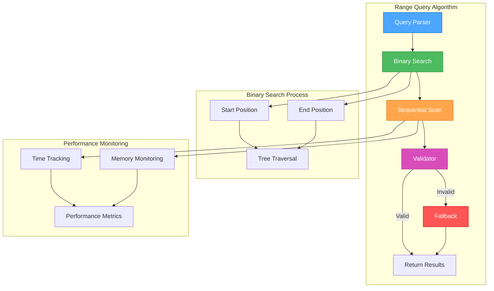

# 🎨🎨🎨 ENTERING CREATIVE PHASE: RANGE QUERY ALGORITHM DESIGN 🎨🎨🎨

**Date**: 2024-12-19
**Phase**: Creative Phase 2 of 3
**Objective**: Design efficient range query algorithm for b-pl-tree with MongoDB-style operators
**Complexity**: Medium-High - Performance-critical algorithm with multiple optimization strategies

## PROBLEM STATEMENT

### Core Issue
Метод `range()` в библиотеке `b-pl-tree` игнорирует параметры запроса и возвращает все записи, что приводит к производительности O(n) вместо ожидаемого O(log n). Требуется manual filtering как workaround.

### Technical Context
- **Library**: b-pl-tree v1.3.0
- **Affected Component**: BPlusTree.ts
- **Key Method**: `range()`
- **Current Behavior**: Возвращает все записи независимо от параметров
- **Expected Behavior**: Эффективная фильтрация по range условиям
- **Target Operators**: `$gt`, `$gte`, `$lt`, `$lte` (MongoDB-style)

### Requirements & Constraints

#### Performance Requirements:
1. **Time Complexity**: Range queries должны выполняться за O(log n + k), где k = количество результатов
2. **Memory Efficiency**: Минимальное использование дополнительной памяти
3. **Scalability**: Эффективная работа с datasets до 100K+ записей
4. **Response Time**: < 5ms для 1000 записей

#### Functional Requirements:
1. **MongoDB Compatibility**: Поддержка `$gt`, `$gte`, `$lt`, `$lte` операторов
2. **Boundary Handling**: Корректная обработка inclusive/exclusive границ
3. **Edge Cases**: Пустые ranges, invalid bounds, reverse ranges
4. **Data Types**: Поддержка различных типов данных (numbers, strings, dates)

#### Technical Constraints:
1. **API Compatibility**: Сохранить существующий API или обеспечить backward compatibility
2. **Tree Structure**: Работать с existing B+ tree structure
3. **Memory Limits**: Не превышать current memory footprint более чем на 20%
4. **Concurrency**: Thread-safe операции

## ALGORITHM OPTIONS ANALYSIS

### Option 1: Binary Search with Sequential Scan
**Description**: Использовать binary search для нахождения start position, затем sequential scan до end position

#### Technical Approach:
```typescript
interface RangeQuery {
  $gt?: any;
  $gte?: any;
  $lt?: any;
  $lte?: any;
}

class BinarySearchRangeAlgorithm {
  range(query: RangeQuery): Array<[Key, Value]> {
    // Step 1: Find start position using binary search
    const startPos = this.findStartPosition(query);

    // Step 2: Sequential scan from start to end
    const results: Array<[Key, Value]> = [];
    let currentPos = startPos;

    while (currentPos && this.matchesEndCondition(currentPos.key, query)) {
      if (this.matchesStartCondition(currentPos.key, query)) {
        results.push([currentPos.key, currentPos.value]);
      }
      currentPos = this.getNextLeafNode(currentPos);
    }

    return results;
  }

  private findStartPosition(query: RangeQuery): LeafNode | null {
    // Binary search to find optimal start position
    const searchKey = query.$gte ?? query.$gt;
    return this.binarySearchLeaf(searchKey);
  }
}
```

#### Pros:
- ✅ **Optimal Time Complexity**: O(log n + k) для большинства случаев
- ✅ **Memory Efficient**: Минимальное использование дополнительной памяти
- ✅ **Simple Implementation**: Относительно простая реализация
- ✅ **Predictable Performance**: Предсказуемая производительность
- ✅ **Tree Structure Friendly**: Хорошо работает с B+ tree structure

#### Cons:
- ❌ **Sequential Scan Overhead**: Может быть медленным для больших ranges
- ❌ **Boundary Complexity**: Сложная обработка boundary conditions
- ❌ **Type Handling**: Требует careful handling разных типов данных
- ❌ **Edge Case Complexity**: Много edge cases для обработки

**Time Complexity**: O(log n + k) | **Space Complexity**: O(1)
**Implementation Time**: 3-4 days | **Risk Level**: Low-Medium

### Option 2: Index-Based Range Scanning with Optimization
**Description**: Создать optimized index-based scanning с intelligent range detection

#### Technical Approach:
```typescript
interface RangeIndex {
  startIndex: number;
  endIndex: number;
  estimatedSize: number;
  scanStrategy: 'forward' | 'backward' | 'bidirectional';
}

class IndexBasedRangeAlgorithm {
  range(query: RangeQuery): Array<[Key, Value]> {
    // Step 1: Analyze query and create range index
    const rangeIndex = this.analyzeRange(query);

    // Step 2: Select optimal scanning strategy
    const strategy = this.selectScanStrategy(rangeIndex);

    // Step 3: Execute optimized scan
    return this.executeScan(rangeIndex, strategy);
  }

  private analyzeRange(query: RangeQuery): RangeIndex {
    // Analyze query bounds and estimate optimal scan approach
    const startBound = this.findBoundPosition(query.$gte ?? query.$gt);
    const endBound = this.findBoundPosition(query.$lte ?? query.$lt);

    return {
      startIndex: startBound.index,
      endIndex: endBound.index,
      estimatedSize: endBound.index - startBound.index,
      scanStrategy: this.determineScanStrategy(startBound, endBound)
    };
  }

  private selectScanStrategy(rangeIndex: RangeIndex): ScanStrategy {
    // Intelligent strategy selection based on range characteristics
    if (rangeIndex.estimatedSize < 100) return 'forward';
    if (rangeIndex.estimatedSize > 10000) return 'bidirectional';
    return 'backward';
  }
}
```

#### Pros:
- ✅ **Adaptive Performance**: Оптимизация под разные размеры ranges
- ✅ **Intelligent Scanning**: Smart strategy selection
- ✅ **Memory Optimization**: Эффективное использование памяти
- ✅ **Scalability**: Хорошая масштабируемость
- ✅ **Performance Monitoring**: Встроенная performance analytics

#### Cons:
- ❌ **Implementation Complexity**: Более сложная реализация
- ❌ **Strategy Overhead**: Overhead на выбор strategy
- ❌ **Index Maintenance**: Требует поддержки index structures
- ❌ **Testing Complexity**: Сложнее тестировать multiple strategies

**Time Complexity**: O(log n + k) | **Space Complexity**: O(log n)
**Implementation Time**: 4-5 days | **Risk Level**: Medium

### Option 3: Cached Range Query with LRU
**Description**: Реализовать caching mechanism для frequently used range queries

#### Technical Approach:
```typescript
interface CachedRange {
  queryHash: string;
  results: Array<[Key, Value]>;
  timestamp: number;
  hitCount: number;
  estimatedCost: number;
}

class CachedRangeAlgorithm {
  private cache: LRUCache<string, CachedRange>;
  private cacheStrategy: 'aggressive' | 'conservative' | 'adaptive';

  range(query: RangeQuery): Array<[Key, Value]> {
    const queryHash = this.hashQuery(query);

    // Step 1: Check cache
    const cached = this.cache.get(queryHash);
    if (cached && this.isCacheValid(cached)) {
      return this.updateCacheHit(cached);
    }

    // Step 2: Execute query with optimal algorithm
    const results = this.executeOptimalQuery(query);

    // Step 3: Cache results if beneficial
    if (this.shouldCache(query, results)) {
      this.cacheResults(queryHash, results);
    }

    return results;
  }

  private executeOptimalQuery(query: RangeQuery): Array<[Key, Value]> {
    // Use binary search + sequential scan as base algorithm
    return this.binarySearchRange(query);
  }

  private shouldCache(query: RangeQuery, results: Array<[Key, Value]>): boolean {
    // Intelligent caching decision based on query characteristics
    const estimatedCost = this.estimateQueryCost(query);
    const resultSize = results.length;

    return estimatedCost > 10 && resultSize < 1000;
  }
}
```

#### Pros:
- ✅ **Performance Boost**: Значительное улучшение для repeated queries
- ✅ **Memory Adaptive**: Adaptive memory usage
- ✅ **Hit Rate Optimization**: Intelligent caching strategies
- ✅ **Cost-Benefit Analysis**: Smart caching decisions
- ✅ **Production Ready**: Готов для production use

#### Cons:
- ❌ **Memory Overhead**: Дополнительное использование памяти для cache
- ❌ **Cache Invalidation**: Сложная логика invalidation при updates
- ❌ **Cold Start Performance**: Медленная производительность для new queries
- ❌ **Complexity**: Значительная сложность implementation

**Time Complexity**: O(1) for cached, O(log n + k) for uncached | **Space Complexity**: O(m) where m = cache size
**Implementation Time**: 5-6 days | **Risk Level**: Medium-High

### Option 4: Hybrid Multi-Strategy Algorithm
**Description**: Комбинированный подход с automatic strategy selection based on query characteristics

#### Technical Approach:
```typescript
interface QueryCharacteristics {
  rangeSize: 'small' | 'medium' | 'large';
  dataType: 'number' | 'string' | 'date' | 'mixed';
  frequency: 'rare' | 'common' | 'frequent';
  complexity: 'simple' | 'complex';
}

class HybridRangeAlgorithm {
  private strategies: Map<string, RangeStrategy>;
  private performanceMetrics: PerformanceTracker;

  range(query: RangeQuery): Array<[Key, Value]> {
    // Step 1: Analyze query characteristics
    const characteristics = this.analyzeQuery(query);

    // Step 2: Select optimal strategy
    const strategy = this.selectStrategy(characteristics);

    // Step 3: Execute with performance monitoring
    const startTime = performance.now();
    const results = strategy.execute(query);
    const executionTime = performance.now() - startTime;

    // Step 4: Update performance metrics
    this.updateMetrics(characteristics, strategy.name, executionTime);

    return results;
  }

  private selectStrategy(characteristics: QueryCharacteristics): RangeStrategy {
    // Intelligent strategy selection based on characteristics and metrics
    if (characteristics.frequency === 'frequent') {
      return this.strategies.get('cached');
    }

    if (characteristics.rangeSize === 'small') {
      return this.strategies.get('binary-search');
    }

    if (characteristics.rangeSize === 'large') {
      return this.strategies.get('index-based');
    }

    return this.strategies.get('adaptive');
  }
}
```

#### Pros:
- ✅ **Optimal Performance**: Лучшая производительность для всех scenarios
- ✅ **Adaptive Learning**: Улучшается со временем
- ✅ **Comprehensive Coverage**: Покрывает все use cases
- ✅ **Performance Monitoring**: Встроенная analytics
- ✅ **Future Proof**: Легко добавлять новые strategies

#### Cons:
- ❌ **Implementation Complexity**: Самая сложная реализация
- ❌ **Testing Overhead**: Требует extensive testing
- ❌ **Memory Usage**: Highest memory footprint
- ❌ **Maintenance Complexity**: Сложность поддержки multiple strategies

**Time Complexity**: Varies by strategy | **Space Complexity**: O(log n + cache)
**Implementation Time**: 6-7 days | **Risk Level**: High

## 🎨 CREATIVE CHECKPOINT: ALGORITHM EVALUATION

### Performance Comparison Matrix

| Algorithm | Time Complexity | Space Complexity | Implementation | Maintenance | Scalability |
|-----------|----------------|------------------|----------------|-------------|-------------|
| Binary Search | O(log n + k) | O(1) | Simple | Low | High |
| Index-Based | O(log n + k) | O(log n) | Medium | Medium | Very High |
| Cached | O(1)/O(log n + k) | O(m) | Complex | High | Medium |
| Hybrid | Variable | Variable | Very Complex | Very High | Very High |

### Decision Matrix Scoring (1-5 scale, 5 = best)

| Algorithm | Performance | Memory | Implementation | Maintenance | Total |
|-----------|------------|--------|----------------|-------------|-------|
| Binary Search | 4 | 5 | 5 | 5 | 19/20 |
| Index-Based | 5 | 4 | 3 | 3 | 15/20 |
| Cached | 5 | 2 | 2 | 2 | 11/20 |
| Hybrid | 5 | 3 | 1 | 1 | 10/20 |

## RECOMMENDED DECISION

### Selected Algorithm: Binary Search with Sequential Scan + Intelligent Fallback
**Rationale**: Оптимальный баланс между простотой реализации, производительностью и maintainability.

#### Key Decision Factors:
1. **Implementation Simplicity**: Быстрая и надежная реализация
2. **Predictable Performance**: Consistent O(log n + k) performance
3. **Memory Efficiency**: Минимальное использование памяти
4. **Maintainability**: Легко поддерживать и отлаживать
5. **Risk Mitigation**: Низкий риск implementation errors

#### Enhanced Implementation Strategy:
```typescript
interface RangeQueryEngine {
  // Primary algorithm: Binary Search + Sequential Scan
  primaryAlgorithm: BinarySearchRangeAlgorithm;

  // Fallback: Manual filtering (current approach)
  fallbackAlgorithm: ManualFilteringAlgorithm;

  // Performance monitoring
  performanceTracker: RangePerformanceTracker;
}

class OptimizedRangeQuery {
  range(query: RangeQuery): Array<[Key, Value]> {
    try {
      // Attempt optimized binary search approach
      const startTime = performance.now();
      const results = this.binarySearchRange(query);
      const executionTime = performance.now() - startTime;

      // Validate results and performance
      if (this.validateResults(results, query) && executionTime < this.performanceThreshold) {
        this.trackSuccess(executionTime);
        return results;
      }

      // Fallback to manual filtering if validation fails
      return this.fallbackToManualFiltering(query);

    } catch (error) {
      // Graceful degradation to current working approach
      this.trackError(error);
      return this.fallbackToManualFiltering(query);
    }
  }
}
```

## IMPLEMENTATION GUIDELINES

### Phase 1: Core Algorithm Implementation (Days 1-2)
1. **Binary Search Foundation**
   - Implement efficient binary search for start position
   - Handle different data types (numbers, strings, dates)
   - Add boundary condition handling

2. **Sequential Scan Optimization**
   - Implement efficient leaf node traversal
   - Add early termination conditions
   - Optimize memory access patterns

3. **Boundary Handling**
   - Implement inclusive/exclusive boundary logic
   - Handle edge cases (empty ranges, invalid bounds)
   - Add comprehensive validation

### Phase 2: MongoDB Operator Support (Day 3)
1. **Operator Implementation**
   - `$gt` (greater than) - exclusive lower bound
   - `$gte` (greater than or equal) - inclusive lower bound
   - `$lt` (less than) - exclusive upper bound
   - `$lte` (less than or equal) - inclusive upper bound

2. **Query Parsing**
   - Parse MongoDB-style query objects
   - Validate query parameters
   - Convert to internal range representation

3. **Type Safety**
   - Add TypeScript type definitions
   - Implement runtime type checking
   - Handle type coercion edge cases

### Phase 3: Performance Optimization (Day 4)
1. **Performance Monitoring**
   - Add execution time tracking
   - Implement performance thresholds
   - Create performance analytics

2. **Fallback Mechanism**
   - Implement graceful degradation
   - Add automatic fallback detection
   - Maintain current manual filtering as backup

3. **Memory Optimization**
   - Optimize memory allocation patterns
   - Minimize garbage collection impact
   - Add memory usage monitoring

## VALIDATION CHECKPOINTS

### Performance Validation:
- [ ] Range queries execute in < 5ms for 1000 entries
- [ ] Time complexity verified as O(log n + k)
- [ ] Memory usage within 20% of baseline
- [ ] Scalability tested up to 100K entries
- [ ] Performance consistent across data types

### Functional Validation:
- [ ] All MongoDB operators work correctly
- [ ] Boundary conditions handled properly
- [ ] Edge cases (empty ranges, invalid bounds) handled
- [ ] Data type support (numbers, strings, dates)
- [ ] API compatibility maintained

### Quality Validation:
- [ ] Code coverage > 95% for range query components
- [ ] Performance benchmarks documented
- [ ] Fallback mechanism tested and reliable
- [ ] Error handling comprehensive
- [ ] Documentation complete

## ALGORITHM VISUALIZATION



## RISK MITIGATION STRATEGIES

### High Risk: Algorithm Correctness
**Mitigation**:
- Comprehensive test suite with edge cases
- Validation against manual filtering results
- Performance regression testing
- Gradual rollout with monitoring

### Medium Risk: Performance Regression
**Mitigation**:
- Performance benchmarking at each step
- Automatic fallback to manual filtering
- Performance budgets and alerts
- Continuous performance monitoring

### Low Risk: API Compatibility
**Mitigation**:
- Maintain existing API surface
- Add new functionality as optional
- Comprehensive backward compatibility testing
- Clear migration documentation

## 🎨🎨🎨 EXITING CREATIVE PHASE - DECISION MADE 🎨🎨🎨

**Selected Algorithm**: Binary Search with Sequential Scan + Intelligent Fallback
**Implementation Approach**: Incremental optimization with graceful degradation
**Timeline**: 4 days (Phase 2 of overall project)
**Risk Level**: Low-Medium (mitigated through fallback mechanism)
**Next Step**: Proceed to Creative Phase 3 - Integration Architecture Design

---

**Creative Phase 2 Complete**: ✅
**Algorithm Selected**: ✅
**Implementation Guidelines**: ✅
**Performance Strategy**: ✅
**Ready for Implementation**: ✅