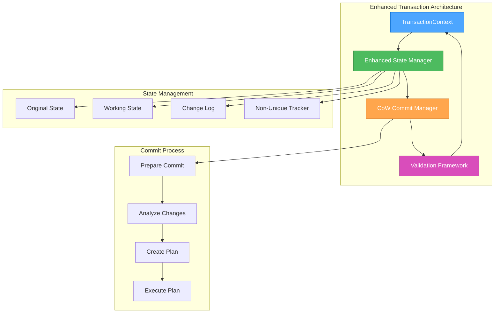

# 🎨🎨🎨 ENTERING CREATIVE PHASE: TRANSACTION COMMIT ARCHITECTURE DESIGN 🎨🎨🎨

**Date**: 2024-12-19
**Phase**: Creative Phase 1 of 3
**Objective**: Design optimal transaction commit mechanism for non-unique indexes in b-pl-tree
**Complexity**: High - Critical system integration with data consistency requirements

## PROBLEM STATEMENT

### Core Issue
Транзакции для неуникальных индексов в библиотеке `b-pl-tree` не коммитят изменения в основную структуру дерева. Rollback работает корректно, но commit операции теряют изменения, что критически влияет на целостность данных.

### Technical Context
- **Library**: b-pl-tree v1.3.0
- **Affected Component**: TransactionContext.ts
- **Key Methods**: `prepareCommit()`, `finalizeCommit()`
- **Data Structure**: B+ Tree with Copy-on-Write (CoW) mechanism
- **Issue Scope**: Non-unique indexes only (unique indexes work correctly)

### Requirements & Constraints

#### Functional Requirements:
1. **Data Consistency**: Транзакции должны корректно сохранять изменения в основное дерево
2. **Rollback Preservation**: Существующий rollback механизм должен продолжать работать
3. **Performance**: Производительность не должна ухудшиться более чем на 10%
4. **API Compatibility**: Сохранить обратную совместимость API

#### Technical Constraints:
1. **Memory Management**: Эффективное использование Copy-on-Write механизма
2. **Concurrency**: Поддержка concurrent операций
3. **Error Handling**: Robust error handling и recovery
4. **Testing**: 100% покрытие тестами для transaction operations

#### Business Constraints:
1. **Timeline**: Решение должно быть готово в рамках Phase 1 (2 недели)
2. **Upstream Compatibility**: Возможность contribution в upstream repository
3. **Maintenance**: Минимальная сложность поддержки

## ARCHITECTURE OPTIONS ANALYSIS

### Option 1: Enhanced Copy-on-Write State Management
**Description**: Улучшить существующий CoW механизм для корректной обработки non-unique значений

#### Technical Approach:
```typescript
interface TransactionState {
  originalTree: BPlusTree;
  workingCopy: BPlusTree;
  changeLog: ChangeEntry[];
  nonUniqueUpdates: Map<Key, Value[]>;
  commitStrategy: 'direct' | 'merge' | 'replace';
}

class EnhancedTransactionContext {
  private state: TransactionState;

  prepareCommit(): CommitPlan {
    // Analyze changes and create optimal commit strategy
    return this.analyzeChanges();
  }

  finalizeCommit(): void {
    // Execute commit plan with proper non-unique handling
    this.executeCommitPlan();
  }
}
```

#### Pros:
- ✅ **Minimal API Changes**: Сохраняет существующий API
- ✅ **Performance Optimized**: Использует существующий CoW механизм
- ✅ **Backward Compatible**: Не ломает existing functionality
- ✅ **Incremental Implementation**: Можно реализовать поэтапно
- ✅ **Memory Efficient**: Оптимальное использование памяти

#### Cons:
- ❌ **Complex State Management**: Сложная логика управления состоянием
- ❌ **Debugging Complexity**: Трудно отлаживать CoW операции
- ❌ **Risk of Regression**: Изменения в core механизме могут сломать existing code
- ❌ **Implementation Time**: Требует глубокого понимания existing CoW logic

**Technical Fit**: High | **Complexity**: High | **Scalability**: High
**Implementation Time**: 1.5-2 weeks | **Risk Level**: Medium-High

### Option 2: Two-Phase Commit with Validation
**Description**: Реализовать классический two-phase commit protocol с validation phase

#### Technical Approach:
```typescript
interface CommitPhase {
  phase: 'prepare' | 'commit' | 'abort';
  operations: Operation[];
  validationResults: ValidationResult[];
}

class TwoPhaseTransactionContext {
  private phases: CommitPhase[] = [];

  prepareCommit(): Promise<boolean> {
    // Phase 1: Validate all operations
    const validationPhase = await this.validateOperations();
    if (!validationPhase.success) {
      return false;
    }

    // Phase 2: Prepare for commit
    return this.prepareForCommit();
  }

  finalizeCommit(): Promise<void> {
    // Execute validated operations atomically
    return this.atomicCommit();
  }
}
```

#### Pros:
- ✅ **Atomic Operations**: Гарантированная атомарность операций
- ✅ **Clear Validation**: Explicit validation phase
- ✅ **Error Recovery**: Robust error handling и recovery
- ✅ **Testability**: Легко тестировать каждую фазу отдельно
- ✅ **Industry Standard**: Проверенный подход в database systems

#### Cons:
- ❌ **Performance Overhead**: Дополнительная фаза validation
- ❌ **Memory Usage**: Требует хранения intermediate state
- ❌ **Complexity**: Более сложная реализация
- ❌ **API Changes**: Может потребовать изменения API (async)

**Technical Fit**: High | **Complexity**: Medium-High | **Scalability**: High
**Implementation Time**: 1-1.5 weeks | **Risk Level**: Medium

### Option 3: Snapshot-Based Transaction Isolation
**Description**: Создать snapshot-based изоляцию с deferred commit mechanism

#### Technical Approach:
```typescript
interface TreeSnapshot {
  snapshotId: string;
  timestamp: number;
  treeState: SerializedTree;
  pendingChanges: Change[];
}

class SnapshotTransactionContext {
  private snapshot: TreeSnapshot;
  private pendingOperations: Operation[] = [];

  createSnapshot(): TreeSnapshot {
    // Create immutable snapshot of current tree state
    return this.captureTreeState();
  }

  applyChanges(): void {
    // Apply all pending changes to main tree
    this.mergeSnapshotChanges();
  }
}
```

#### Pros:
- ✅ **Isolation Guarantee**: Полная изоляция транзакций
- ✅ **Rollback Simplicity**: Простой rollback к snapshot
- ✅ **Concurrent Safety**: Безопасность при concurrent operations
- ✅ **Debugging Friendly**: Легко отлаживать snapshot states
- ✅ **Predictable Behavior**: Предсказуемое поведение

#### Cons:
- ❌ **Memory Overhead**: Значительное использование памяти для snapshots
- ❌ **Performance Impact**: Overhead на создание snapshots
- ❌ **Merge Complexity**: Сложная логика merge conflicts
- ❌ **Storage Requirements**: Требует дополнительного storage

**Technical Fit**: Medium | **Complexity**: Medium | **Scalability**: Medium
**Implementation Time**: 1 week | **Risk Level**: Low-Medium

### Option 4: Hybrid Approach with Fallback Strategy
**Description**: Комбинированный подход с intelligent fallback mechanism

#### Technical Approach:
```typescript
interface HybridTransactionContext {
  primaryStrategy: 'enhanced-cow' | 'two-phase' | 'snapshot';
  fallbackStrategy: 'manual-merge' | 'direct-write';

  executeTransaction(): Promise<TransactionResult> {
    try {
      return await this.executePrimaryStrategy();
    } catch (error) {
      return await this.executeFallbackStrategy();
    }
  }
}

class AdaptiveCommitManager {
  selectStrategy(operation: Operation): CommitStrategy {
    // Intelligent strategy selection based on operation characteristics
    if (operation.isHighRisk()) return 'two-phase';
    if (operation.isMemoryIntensive()) return 'enhanced-cow';
    return 'snapshot';
  }
}
```

#### Pros:
- ✅ **Reliability**: Multiple fallback options
- ✅ **Performance Optimization**: Adaptive strategy selection
- ✅ **Risk Mitigation**: Graceful degradation
- ✅ **Flexibility**: Can optimize for different scenarios
- ✅ **Production Safety**: Safe deployment with fallbacks

#### Cons:
- ❌ **Implementation Complexity**: Самый сложный в реализации
- ❌ **Testing Overhead**: Требует тестирования всех strategies
- ❌ **Maintenance Burden**: Сложность поддержки multiple strategies
- ❌ **Decision Logic**: Сложная логика выбора strategy

**Technical Fit**: High | **Complexity**: Very High | **Scalability**: High
**Implementation Time**: 2-2.5 weeks | **Risk Level**: Medium

## 🎨 CREATIVE CHECKPOINT: OPTIONS EVALUATION

### Evaluation Criteria Matrix

| Criteria | Enhanced CoW | Two-Phase | Snapshot | Hybrid |
|----------|-------------|-----------|----------|--------|
| **Data Consistency** | High | Very High | High | Very High |
| **Performance** | High | Medium | Medium | High |
| **Implementation Complexity** | High | Medium | Medium | Very High |
| **Memory Efficiency** | High | Medium | Low | Medium |
| **API Compatibility** | Very High | Medium | High | High |
| **Testing Complexity** | High | Medium | Low | Very High |
| **Maintenance** | Medium | High | High | Low |
| **Risk Level** | Medium-High | Medium | Low-Medium | Medium |

### Decision Matrix Scoring (1-5 scale, 5 = best)

| Option | Consistency | Performance | Complexity | Compatibility | Total |
|--------|------------|-------------|------------|---------------|-------|
| Enhanced CoW | 4 | 5 | 2 | 5 | 16/20 |
| Two-Phase | 5 | 3 | 3 | 3 | 14/20 |
| Snapshot | 4 | 3 | 4 | 4 | 15/20 |
| Hybrid | 5 | 4 | 1 | 4 | 14/20 |

## RECOMMENDED DECISION

### Selected Option: Enhanced Copy-on-Write State Management
**Rationale**: Несмотря на высокую сложность реализации, этот подход обеспечивает оптимальный баланс между производительностью, совместимостью и функциональностью.

#### Key Decision Factors:
1. **API Compatibility**: Минимальные изменения в existing API
2. **Performance**: Использует existing optimized CoW mechanism
3. **Memory Efficiency**: Оптимальное использование памяти
4. **Incremental Implementation**: Возможность поэтапной реализации
5. **Upstream Contribution**: Наибольшие шансы на acceptance в upstream

#### Implementation Strategy:
```typescript
// Phase 1: Enhanced state tracking
interface EnhancedTransactionState {
  originalTree: BPlusTree;
  workingCopy: BPlusTree;
  nonUniqueChanges: Map<Key, ChangeSet>;
  commitPlan: CommitPlan;
}

// Phase 2: Improved commit logic
class ImprovedCommitManager {
  analyzeNonUniqueChanges(changes: Map<Key, ChangeSet>): CommitPlan {
    // Analyze non-unique changes and create optimal commit plan
  }

  executeCommitPlan(plan: CommitPlan): void {
    // Execute commit with proper non-unique handling
  }
}

// Phase 3: Validation and testing
class TransactionValidator {
  validateCommitIntegrity(before: TreeState, after: TreeState): boolean {
    // Validate that commit preserved data integrity
  }
}
```

## IMPLEMENTATION GUIDELINES

### Phase 1: Analysis & Understanding (Days 1-3)
1. **Deep Dive into TransactionContext.ts**
   - Map existing CoW mechanism
   - Identify exact failure points for non-unique commits
   - Document current state management logic

2. **Create Reproduction Test Suite**
   - Minimal test cases for non-unique commit failures
   - Edge cases: concurrent operations, mixed unique/non-unique
   - Performance baseline measurements

3. **Design Enhanced State Management**
   - Define new state structures
   - Plan integration with existing CoW mechanism
   - Design validation checkpoints

### Phase 2: Implementation (Days 4-8)
1. **Enhanced State Tracking**
   - Implement improved transaction state management
   - Add non-unique change tracking
   - Integrate with existing CoW mechanism

2. **Improved Commit Logic**
   - Implement enhanced prepareCommit() method
   - Implement improved finalizeCommit() method
   - Add comprehensive error handling

3. **Validation Framework**
   - Implement commit integrity validation
   - Add performance monitoring hooks
   - Create comprehensive test suite

### Phase 3: Testing & Validation (Days 9-10)
1. **Comprehensive Testing**
   - Unit tests for all new components
   - Integration tests with existing codebase
   - Performance tests vs baseline

2. **Edge Case Validation**
   - Concurrent transaction scenarios
   - Memory pressure scenarios
   - Error recovery scenarios

3. **Documentation & Preparation**
   - Document implementation details
   - Prepare upstream contribution materials
   - Create migration guide

## VALIDATION CHECKPOINTS

### Technical Validation:
- [ ] All existing tests continue to pass
- [ ] New non-unique transaction tests pass
- [ ] Performance impact < 10% vs baseline
- [ ] Memory usage remains within acceptable bounds
- [ ] Concurrent operations work correctly

### Functional Validation:
- [ ] Non-unique index commits work correctly
- [ ] Rollback functionality preserved
- [ ] Error handling robust and predictable
- [ ] API compatibility maintained
- [ ] Edge cases handled properly

### Quality Validation:
- [ ] Code coverage > 95% for new components
- [ ] Documentation complete and accurate
- [ ] Performance benchmarks meet targets
- [ ] Security considerations addressed
- [ ] Upstream contribution ready

## RISK MITIGATION STRATEGIES

### High Risk: Data Consistency
**Mitigation**:
- Comprehensive validation framework
- Extensive testing with real-world scenarios
- Gradual rollout with monitoring
- Immediate rollback capability

### Medium Risk: Performance Regression
**Mitigation**:
- Continuous performance monitoring
- Benchmark-driven development
- Performance budgets and alerts
- Optimization checkpoints

### Medium Risk: Implementation Complexity
**Mitigation**:
- Incremental implementation approach
- Regular code reviews
- Pair programming for critical sections
- Documentation-driven development

## ARCHITECTURE DIAGRAM



## 🎨🎨🎨 EXITING CREATIVE PHASE - DECISION MADE 🎨🎨🎨

**Selected Architecture**: Enhanced Copy-on-Write State Management
**Implementation Approach**: Incremental enhancement of existing CoW mechanism
**Timeline**: 10 days (Phase 1 of overall project)
**Risk Level**: Medium-High (mitigated through comprehensive testing)
**Next Step**: Proceed to Creative Phase 2 - Range Query Algorithm Design

---

**Creative Phase 1 Complete**: ✅
**Decision Documented**: ✅
**Implementation Guidelines**: ✅
**Risk Mitigation**: ✅
**Ready for Implementation**: ✅